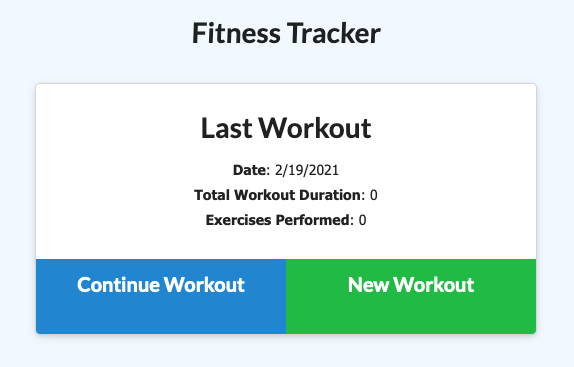

# workout-tracker

## Description

This is a workout tracker application that uses Node, Express, and a Mongoose DB. The purpose of this application is to keep track of your workout's sets, reps, duration, and distance depending on whether it is a resitance or cardio exercise. You will also be able to view the combined weight and duration for workouts from the past seven days.

## Installation

To install this respository you will need Node, Express, and a mongoose database.

## Usage

https://shrouded-shore-52628.herokuapp.com

To run the application make sure that you are in the root directory and use your integrated terminal to type `npm start`. Once you have the application running, you can add a workout by clicking "New Workout" and choosing the correct distance or sets depending on your exercise. After you have completed a workout you can checkout the "Dashboard" for stats about your recent workouts.
